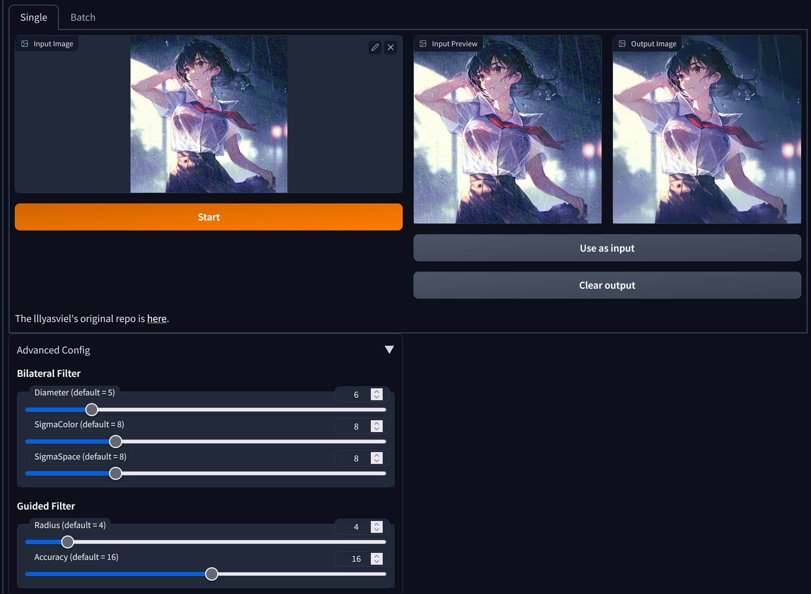
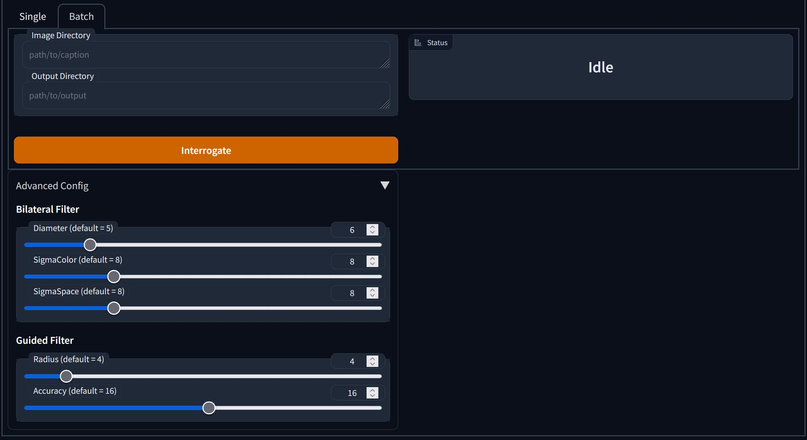

# stable-diffusion-webui-adverse-cleaner-tab

[Adverse Cleaner](https://github.com/lllyasviel/AdverseCleaner/tree/main) as a tab extension for AUTOMATIC1111's webui.

# Features

- Easy to remove [adversarial noise](https://arxiv.org/abs/1412.6572) from a single image
- Batch processing that can remove noise from multiple images.

# Troubleshooting 

- ModuleNotFoundError: No module named 'cv2.ximgproc'

You need to manually install `opencv-contrib-python` because the webui uses opencv-python, so the extension can't modify the opencv package while running.

First you open the stable-diffusion-webui folder in terminal.

```bash
cd /path/to/stable-diffusion-webui
```

Activate venv,
```bash
./venv/Scripts/activate
```

Install `opencv-contrib-python`
```
pip install opencv-contrib-python
```

# Screenshots





# Related links

- [As a script extension](https://github.com/gogodr/AdverseCleanerExtension)
- [HuggingFace Space](https://huggingface.co/spaces/p1atdev/AdverseCleaner)

